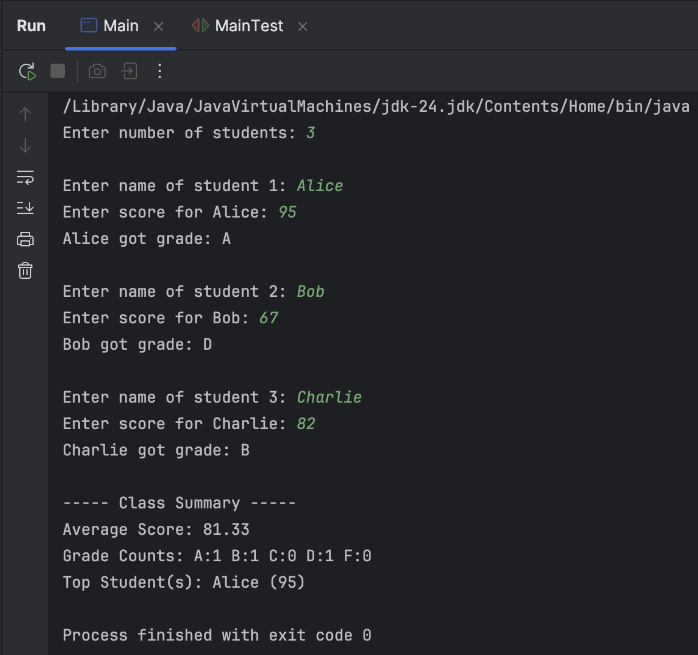

# Lab 5: Student Grade Analyzer

## Author

**Dzelle Faith R. Tan**

## Description

This program allows users to input multiple students' names and scores, calculates their grades, and then summarizes the class performance at the end.

## Screenshot of Output

